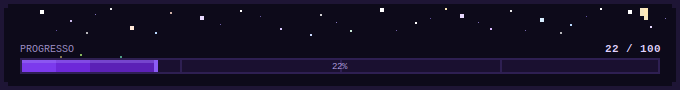

[README.md](https://github.com/user-attachments/files/26986348/README.md)
<div align="center">

# ◈ 100 Desafios de Algoritmos e Lógica ◈

*resolvendo um problema de cada vez*

</div>

---

<!-- PROGRESS_START — não edite este bloco, o GitHub Actions atualiza automaticamente -->
<div align="center">




&nbsp;

&nbsp;


</div>
<!-- PROGRESS_END -->

---

## ✦ sobre o desafio

Um repositório de **resistência e consistência** — 100 algoritmos resolvidos em **Java** e **Python**, do mais simples ao mais instigante. Cada arquivo é um problema a menos na pilha e uma habilidade a mais na bagagem.


---

## ✦ estrutura

```
📂 100-Desafios-de-Algoritmos
 ├── 📁 Java/
 │    └── Ex##_NomeDoDesafio.java
 └── 📁 Python/
      └── nomeDoDesafio.py
```

---

## ✦ linguagens

<div align="center">


</div>

---

## ✦ como usar

Clone o repositório e explore as soluções:

```bash
git clone https://github.com/ElisaPrestes/100-Desafios-de-Algoritmos.git
cd 100-Desafios-de-Algoritmos
```

Cada arquivo é autocontido e pode ser executado de forma independente.

---

## ✦ sobre o progresso automático

A barra acima é atualizada a cada `push` via **GitHub Actions** — ele conta todos os `.java` e `.py`, regenera o `progress.svg` com os números exatos, e faz commit automático.

---

<div align="center">

**feito com 🧠 e muita persistência por [ElisaPrestes](https://github.com/ElisaPrestes)**

</div>
